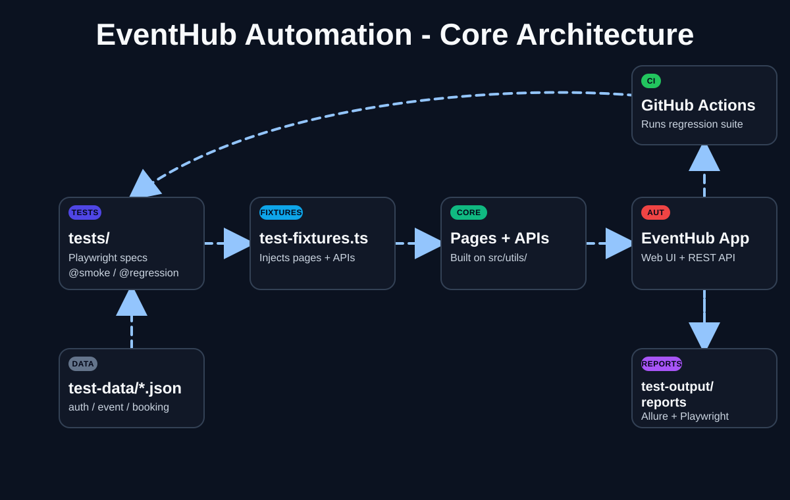

# EventHub Automation Project

<p>
  
  
  
  
  
</p>

This repository contains an E2E automation suite for EventHub, built with Playwright and TypeScript. The project follows a layered test architecture based on the Page Object Model (POM), API endpoint abstractions, reusable utilities, and rich reporting with Allure and Playwright HTML.

## Contents

- [EventHub Automation Project](#eventhub-automation-project)
  - [Contents](#contents)
  - [Overview](#overview)
  - [Tech Stack](#tech-stack)
  - [Architecture](#architecture)
    - [Layer responsibilities](#layer-responsibilities)
  - [Design Patterns](#design-patterns)
  - [Getting Started](#getting-started)
    - [Prerequisites](#prerequisites)
    - [Install dependencies](#install-dependencies)
    - [Environment configuration](#environment-configuration)
  - [Running Tests](#running-tests)
  - [Test Tagging](#test-tagging)
  - [Reports and Logs](#reports-and-logs)
  - [CI/CD](#cicd)
  - [Project Structure](#project-structure)

## Overview

The suite exercises the EventHub application across core user journeys in Authentication, Events, and Bookings. It is designed to be readable, maintainable, and scalable by separating test intent from implementation details.

Key goals of the project:

- Keep UI specs focused on business flows
- Reuse page objects and API clients across test scenarios
- Centralize wait, assertion, and request logic in shared utilities
- Produce readable reports for local execution and CI pipelines
- Reuse a single authenticated browser session for consistent test setup

## Tech Stack

| Category               | Technology                                 |
| ---------------------- | ------------------------------------------ |
| Test Runner            | [Playwright Test](https://playwright.dev/) |
| Language               | TypeScript                                 |
| Reporting              | Allure Report, Playwright HTML Report      |
| Logging                | Winston                                    |
| Environment Management | dotenv, cross-env                          |
| CI/CD                  | GitHub Actions                             |

## Architecture

The framework is organized into clear layers so that tests interact with page objects and API clients instead of directly managing browser behavior or HTTP requests. Shared utilities handle actions, assertions, waits, configuration, and logging.



The flow is intentionally layered:

- JSON fixtures feed test data into the specifications
- Fixtures wire page objects and API endpoints into the test lifecycle
- Page objects and API clients build on the shared utilities layer
- Results are published in Allure and Playwright reports and archived by CI

### Layer responsibilities

- [tests](tests) — Playwright specs grouped by feature area: Authentication, Events, and Bookings
- [src/fixtures/test-fixtures.ts](src/fixtures/test-fixtures.ts) — Custom test fixtures that inject page objects and API endpoints into tests
- [src/pages](src/pages) — Page Object Model classes such as LoginPage, EventsPage, AddEventPage, MyBookingsPage, and CancelBookingDialog
- [src/apis](src/apis) — API layer for registration, events, and bookings
- [src/utils/actions](src/utils/actions) — Shared UI and API action helpers
- [src/utils/assertions](src/utils/assertions) — Reusable assertions for UI and API validation
- [src/utils/stepDecorator.ts](src/utils/stepDecorator.ts) — Decorator that creates readable test steps in Playwright and Allure
- [src/utils/logger](src/utils/logger) — Winston-based logger output
- [src/utils/envConfig.ts](src/utils/envConfig.ts) and [src/utils/urls.ts](src/utils/urls.ts) — Environment and browser configuration handling
- [src/utils/setup/global-setup.ts](src/utils/setup/global-setup.ts) — Global setup that creates a reusable authenticated session
- [test-data](test-data) — Static JSON fixtures
- [test-output](test-output) — Generated logs and reports

## Design Patterns

- Page Object Model (POM) — UI interactions are encapsulated in page classes so tests stay readable and maintainable.
- API abstraction layer — HTTP calls are centralized in endpoint classes instead of being repeated across specs.
- Fixture-based dependency injection — Reusable page and endpoint instances are provided automatically to each test.
- Data-driven testing — Data is stored externally in JSON fixtures rather than hardcoded inside the specs.

This design keeps test code concise and declarative while isolating low-level automation details in reusable layers.

## Getting Started

### Prerequisites

- [Node.js](https://nodejs.org/) (LTS)
- npm

### Install dependencies

```bash
npm install
npx playwright install --with-deps
```

### Environment configuration

Create a `.env` file in the project root with the following values:

```env
# One of: test | staging
ENV=test

# One of: chrome | firefox | edge | safari
BROWSER=chrome

# One of: true | false
HEADLESS=true

# Timeouts (milliseconds)
TEST_TIMEOUT_MS=60000
EXPECT_TIMEOUT_MS=10000
```

Environment-specific base URLs are defined in [src/utils/urls.ts](src/utils/urls.ts).

## Running Tests

| Command                   | Description                                                       |
| ------------------------- | ----------------------------------------------------------------- |
| `npm test`                | Clean results, run the full suite, and generate the Allure report |
| `npm run test:chrome`     | Run the suite in Google Chrome                                    |
| `npm run test:firefox`    | Run the suite in Mozilla Firefox                                  |
| `npm run test:edge`       | Run the suite in Microsoft Edge                                   |
| `npm run test:smoke`      | Run tests tagged with `@smoke`                                    |
| `npm run test:regression` | Run tests tagged with `@regression`                               |
| `npm run report`          | Generate the Allure report from existing test results             |
| `npm run report:open`     | Open the last generated Allure report                             |

For direct Playwright execution, use commands like:

```bash
npx playwright test tests/Events
npx playwright test --grep @smoke
npx playwright show-report test-output/reports/playwright-report
```

## Test Tagging

The test suite uses tags to support selective execution:

- `@smoke` — critical business flow checks for a quick validation pass
- `@regression` — the broader regression set for CI and release coverage

## Reports and Logs

- Playwright HTML report: `test-output/reports/playwright-report/`
- Allure report and results: `test-output/reports/allure-report/` and `test-output/reports/allure-results/`
- Logs: `test-output/logs/logs.log`

Allure configuration is defined in [allurerc.mjs](allurerc.mjs), and the logger is implemented in [src/utils/logger/logger.ts](src/utils/logger/logger.ts).

## CI/CD

The GitHub Actions workflow in [.github/workflows/playwright.yml](.github/workflows/playwright.yml) runs the regression suite on pushes, pull requests, and manual triggers.

The workflow typically does the following:

1. Checks out the repository and installs dependencies
2. Installs Playwright browsers and dependencies
3. Restores cached Allure history
4. Executes the regression suite with `npm run test:regression`
5. Saves updated Allure history back to cache
6. Uploads Playwright and Allure artifacts for review, even when a run fails

## Project Structure

```text
src/
  apis/                 API client classes for authentication, events, and bookings
  fixtures/             Playwright custom fixtures
  pages/                Page Object Model classes for UI interactions
  utils/
    actions/            Reusable UI and API action helpers
    assertions/         Shared assertions
    logger/             Winston logger implementation
    setup/              Global setup for session reuse
    waits/              Wait utilities
    envConfig.ts        Browser and environment configuration
    urls.ts             Base URL definitions by environment
    timeUtils.ts        Time/date helper utilities
    stepDecorator.ts    Test step decorator for reporting

test-data/             JSON fixtures and schemas

tests/                 Test specs by feature area

test-output/           Generated reports and logs

allurerc.mjs
playwright.config.ts
package.json
storage-state.json
```

This project is structured to support maintainable automation, quick debugging, and reliable reporting across product and regression cycles.